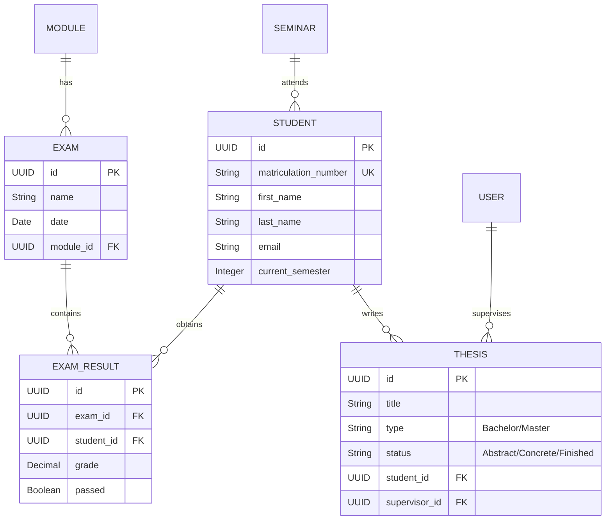

<div align="center">

# 🎓 Lehrstuhl App

[](https://elixir-lang.org/)
[](https://www.phoenixframework.org/)
[](https://hexdocs.pm/phoenix_live_view/Phoenix.LiveView.html)
[](https://www.postgresql.org/)
[](LICENSE)

**Ein optimiertes Echtzeit-Verwaltungssystem für universitäre Fakultäten zur effizienten Handhabung von Abschlussarbeiten, Seminaren und Prüfungen.**

[Live Demo](https://lehrstuhl-app.fly.dev/) • [Features](#-features) • [Tech Stack](#-tech-stack) • [Installation](#-installation) • [Dokumentation](#-dokumentation) • [Architektur](#-architektur)

</div>

---

## 🎯 Über das Projekt

Die **Lehrstuhl App** hilft akademischen Lehrstühlen dabei, ihren administrativen Aufwand zu bewältigen. Sie ersetzt komplexe Excel-Tabellen durch eine zentralisierte, reaktive Webanwendung. Dozenten können Abschlussarbeiten filtern, Prüfungsnoten erfassen, Seminare verwalten und Leistungsstatistiken visualisieren.

Entwickelt mit **Elixir** und **Phoenix LiveView**, bietet die Anwendung Echtzeit-Updates und eine extrem schnelle Benutzererfahrung ohne Page Reloads.

### 💡 Warum dieses Projekt?

> *"Verwaltung sollte Forschung und Lehre unterstützen, nicht behindern."*

Traditionelle Verwaltungstools sind oft statisch und langsam. Dieses System nutzt die **BEAM VM**, um Tausende von gleichzeitigen Verbindungen zu verwalten und Änderungen (z.B. Seminarbelegung) sofort für alle Nutzer sichtbar zu machen.

---

## 📚 Dokumentation

Die vollständige Dokumentation über den gesamten Software-Entwicklungszyklus befindet sich im GitHub Wiki:

🔗 **[Hier klicken: Vollständige Dokumentation (Wiki)](https://github.com/Thomas7899/Lehrstuhl-App/wiki)**

| Sektion | Beschreibung |
|---------|--------------|
| [Requirements](https://github.com/Thomas7899/Lehrstuhl-App/wiki/Anforderungen-Lehrstuhl%E2%80%90App) | Funktionale & nicht-funktionale Anforderungen (A1–A7) |
| [Datenmodell](https://github.com/Thomas7899/Lehrstuhl-App/wiki/Datenhaltung) | ER-Diagramme & Datenbank-Design |
| [Entwurf](https://github.com/Thomas7899/Lehrstuhl-App/wiki/Entwurfsentscheidungen-und-Datenmodell) | Architekturentscheidungen & Implementierungsdetails |
| [Evaluation](https://github.com/Thomas7899/Lehrstuhl-App/wiki/Evaluation) | Cognitive Walkthrough Usability-Tests & Ergebnisse |

---

## ✨ Features

<table>
<tr>
<td width="50%">

### 🎓 Abschlussarbeiten & Seminare
- **Erweitertes Filtering** nach Semester, Betreuer & Projekt
- **Status-Tracking** (Abstract → Konkret → Abgegeben)
- **Seminar Finder** mit Echtzeit-Suche für Studenten
- **Themenvergabe** und Kapazitätsplanung

</td>
<td width="50%">

### 📊 Dashboard & Analytics
- **Echtzeit-KPIs** (Laufende Arbeiten, Ausstehende Prüfungen)
- **Notenverteilung** (Visualisierung der Durschnittsnoten)
- **Interaktive Charts** mit SVG/CSS
- **Modul-Statistiken** zur Leistungsüberwachung

</td>
</tr>
<tr>
<td width="50%">

### 📝 Prüfungsverwaltung
- **CSV Import** für schnelle Notenerfassung
- **Teilnehmerlisten** und Terminverwaltung
- **Export-Funktionen** für Prüfungsämter
- **Historie** vergangener Prüfungsperioden

</td>
<td width="50%">

### 👤 Profile & Sicherheit
- **Digitale Studentenakte** mit Fortschrittsanzeige
- **Rollenbasiertes System** (Admin vs. Public View)
- **Sicheres Login** für Mitarbeiter
- **DSGVO-konforme** Datenhaltung

</td>
</tr>
</table>

---

## 🛠 Tech Stack

### Core Stack

| Technologie | Version | Verwendung |
|-------------|---------|------------|
| **Elixir** | 1.14+ | Funktionale Programmiersprache |
| **Phoenix** | 1.7+ | Web Framework |
| **Phoenix LiveView** | 0.19+ | Real-time Frontend Engine |
| **Ecto** | 3.10+ | Database Wrapper / Query Generator |
| **PostgreSQL** | 15+ | Datenbank |
| **Tailwind CSS** | 3.x | Utility-first CSS Framework |

### DevOps & Tools

| Technologie | Verwendung |
|-------------|------------|
| **Fly.io** | Cloud Deployment |
| **Docker** | Containerization (optional) |
| **Git** | Version Control |
| **ExUnit** | Testing Framework |

---

## 🏗 Architektur

Die Anwendung folgt dem klassischen **Phoenix Context** Design Pattern, wobei LiveView für die Interaktivität sorgt, ohne dass eine komplexe SPA (Single Page Application) und API-Trennung notwendig ist.

```text
┌─────────────────────────────────────────────────────────────────┐ │ BROWSER (Client) │ │ WebSockets (Phoenix Channels) │ │ ▲ │ │ └───────────────────────────┼────┼────────────────────────────────┘ │ ▼ ┌───────────────────────────┼────┼────────────────────────────────┐ │ SERVER │ │ (Phoenix / BEAM VM) │ │ │ │ ┌─────────────────────────────────────────────────────────┐ │ │ │ Web Layer (LiveView) │ │ │ │ DashboardLive │ ThesisLive │ ExamLive │ StudentLive │ │ │ │ (Stateful Processes per User Session) │ │ │ └───────────────────────────┬─────────────────────────────┘ │ │ │ calls │ │ ┌───────────────────────────▼─────────────────────────────┐ │ │ │ Context Layer (Business Logic) │ │ │ │ Theses │ Seminars │ Exams │ Accounts │ Stats │ │ │ └───────────────────────────┬─────────────────────────────┘ │ │ │ uses │ │ ┌───────────────────────────▼─────────────────────────────┐ │ │ │ Schema Layer (Ecto) │ │ │ │ Thesis │ Student │ ExamResult │ User │ Seminar │ │ │ └─────────────────────────────────────────────────────────┘ │ │ │ │ └───────────────────────────────┼─────────────────────────────────┘ │ SQL ┌───────────────────────────────▼─────────────────────────────────┐ │ DATABASE │ │ PostgreSQL │ └─────────────────────────────────────────────────────────────────┘
```


### 🗂 Datenmodell (ER-Diagramm)



---

## 🚀 Installation

### Voraussetzungen

- 💧 **Elixir 1.14+** (Installationsanleitung)
- 📦 **Erlang/OTP 25+**
- 🐘 **PostgreSQL 15+**

### 1️⃣ Repository klonen

```bash
git clone https://github.com/your-username/lehrstuhl-app.git
cd lehrstuhl-app
```

### 2️⃣ Abhängigkeiten installieren

```bash
mix deps.get
```

### 3️⃣ Datenbank einrichten

Passe bei Bedarf die `config/dev.exs` an (Username/Passwort). Dann führe aus:

```bash
mix ecto.setup
```

### 4️⃣ Server starten

```bash
mix phx.server
```

> 📍 App läuft auf: **http://localhost:4000**

## 🔐 Test-Zugangsdaten

Um die Admin-Features in der lokalen Version oder der Demo zu testen:

| Rolle | Email | Passwort |
|-------|-------|----------|
| Admin | admin@example.com | password123 |

---

## 📸 Screenshots

Hier ein Einblick in die Anwendung, vom zentralen Dashboard bis zur detaillierten Filterung.

<div align="center"> 
<h3>🎛️ Zentrales Dashboard</h3> 
 <p><em>Schneller Überblick über alle administrativen Prozesse und anstehende Aufgaben.</em></p> </div>

<table>
  <tr>
    <td width="50%" align="center">
      <h3>🔍 Abschlussarbeiten Filter</h3>
      
      <p>Detaillierte Filterung nach Projekt, Semester und Status.</p>
    </td>
    <td width="50%" align="center">
      <h3>📊 Modul Statistiken</h3>
      
      <p>Performance-Tracking und Notenverteilung pro Modul.</p>
    </td>
  </tr>
</table>

## 🔮 Roadmap

- [x] ✅ Kernverwaltung für Abschlussarbeiten und Seminare
- [x] ✅ CSV Import für Prüfungsnoten
- [x] ✅ Datenvisualisierung (Notenverteilung)
- [ ] 📱 Verbesserte Mobile Responsiveness
- [ ] 📄 PDF Export für Transcripts of Records
- [ ] 📅 Kalender-Integration für Prüfungstermine

---

<div align="center">

Made with ❤️ and ☕ by Thomas Osterlehner

</div>
